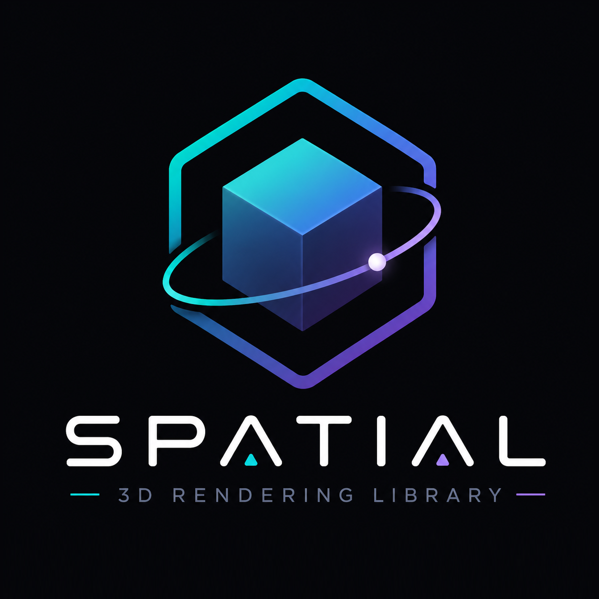

<h1 align="left">Hello, I am <a href="https://danieldevsite.lovable.app">Daniel (DanielitoCode)</a></h1>

  

## About me

Android Developer (Kotlin) focused on architecture, best practices, and tools to build scalable products. At the same time, I develop web side projects with Svelte..

<h2 align="left">Languages and Tools</h2>

### Mobile (Android/Kotlin)

  
  
  
  
  

### Frontend Web

  
  
  
  
  

### Design & Tools

  
  
  
  
  

---

## Android Projects

<table>
  <tr>
    <td align="center" width="50%">
      <h3 align="center">Spatial</h3>
      <a href="https://github.com/danielitoCode/Spatial" target="_blank">
        

          
        

      </a>
      
No-Pain OpenGL. 3D Powered by Compose Spirit: Spatial is a declarative 3D rendering library for Android, inspired by Jetpack Compose.

      

        
        
        
      

    </td>
    <td align="center" width="50%">
      <h3 align="center">AlejoTaller</h3>
      <a href="https://github.com/danielitoCode/AlejoTaller" target="_blank">
        

          
        

      </a>
      
Android project: modular architecture (features + core), DI and local persistence, with a backend in Appwrite.

      

        
        
        
        
        
      

    </td>
  </tr>
  <tr>
    <td align="center" width="50%">
  <h3 align="center">SatExplorer</h3>
  <a href="https://github.com/danielitoCode/SatExplorer" target="_blank">
    

      
    

  </a>
  
Visualización 3D inmersiva de satélites y órbitas en tiempo real. Construido con <strong>Spatial</strong> OpenGL ES 3.0, Jetpack Compose and Koin.

  

    
    
    
    
    
  

</td>
    <td align="center" width="50%">
      <h3 align="center">Deluxe</h3>
      <a href="https://github.com/danielitoCode/Deluxe" target="_blank">
        

          
        

      </a>
      
Android app for jewelry stores (catalog/management). Project focused on UI and product flow.

      

        
        
        
        
        
      

    </td>
  </tr>
  <tr>
    <td align="center" width="50%">
      <h3 align="center">Iris 🔬 <em>(experimental)</em></h3>
      <a href="https://github.com/danielitoCode/Iris" target="_blank">
        

          
        

      </a>
      
Experimental project for object detection with local AI using <strong>YOLO11s</strong> — fully on-device inference, no server.

      

        
        
        
        
        
      

    </td>
    <td width="50%"/>
  </tr>
</table>

## Projects in development

<table>
  <tr>
    <td align="center" width="50%">
      <h3 align="center">AppMakeUp</h3>
      <a href="https://github.com/danielitoCode/AppMakeup" target="_blank">
        

          
        

      </a>
      
Tooling to model and generate base structures of apps in a predictable way (architecture-first).

      

        
        
        
      

    </td>
    <td align="center" width="50%">
      <h3 align="center">compose_svelted</h3>
      <a href="https://github.com/danielitoCode/compose_svelted" target="_blank">
        

          
        

      </a>
      
UI framework for Svelte inspired by Jetpack Compose: declarative layout, immutable modifiers, and Compose-style navigation.

      

        
        
        
      

    </td>
  </tr>
</table>

## Web Frontend

<table>
  <tr>
    <td align="center" width="50%">
      <h3 align="center">dash_alejo_taller</h3>
      <a href="https://github.com/danielitoCode/dash_alejo_taller" target="_blank">
        

          
        

      </a>
      
Complementary web application in Svelte for <strong>AlejoTaller</strong>: management of products for sale for the electronics store.

      

        
        
        
        
      

    </td>
    <td width="50%"></td>
  </tr>
</table>

## Functions serverless & Cloudflare Workers

<table>
  <tr>
    <td align="center" width="50%">
      <h3 align="center">starter-function</h3>
      <a href="https://github.com/danielitoCode/starter-function" target="_blank">
        

          
        

      </a>
      
Template/starter for serverless functions and Workers (ideal for lightweight APIs and automations).

      

        
        
        
      

    </td>
    <td align="center" width="50%">
      <h3 align="center">google_auth_appwrite</h3>
      <a href="https://github.com/danielitoCode/google_auth_appwrite" target="_blank">
        

          
        

      </a>
      
Cloudflare Worker that implements an authentication flow with Google OAuth for <strong>Appwrite BaaS</strong>.

      

        
        
        
        
      

    </td>
  </tr>
  <tr>
    <td align="center" width="50%">
      <h3 align="center">telegram_messages</h3>
      <a href="https://github.com/danielitoCode/telegram_messages" target="_blank">
        

          
        

      </a>
      
Node.js function to send messages to a Telegram group from the backend, using the BotFather API.

      

        
        
        
        
      

    </td>
    <td align="center" width="50%">
      <h3 align="center">list_users</h3>
      <a href="https://github.com/danielitoCode/list_users" target="_blank">
        

          
        

      </a>
      
Serverless function in Appwrite to list users with access control by <strong>Admin</strong> role.

      

        
        
        
      

    </td>
  </tr>
</table>

---

## Connect

- Email: `daniel.imbert96@gmail.com`
- LinkedIn: `www.linkedin.com/in/daniel-imbert-68b4952b4`

Last update: marzo 2026
