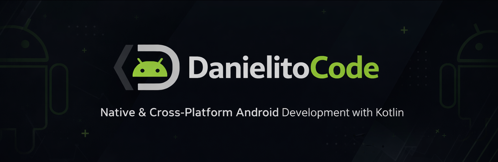
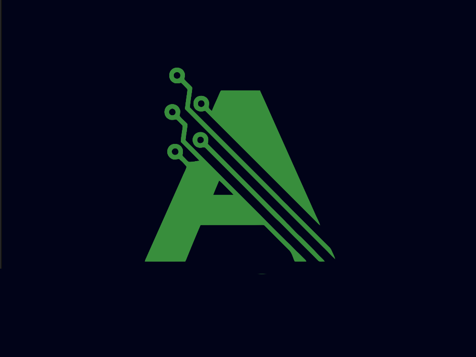
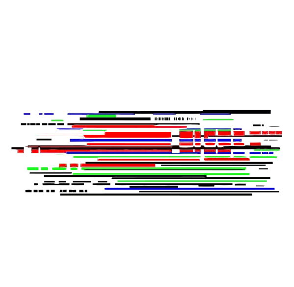
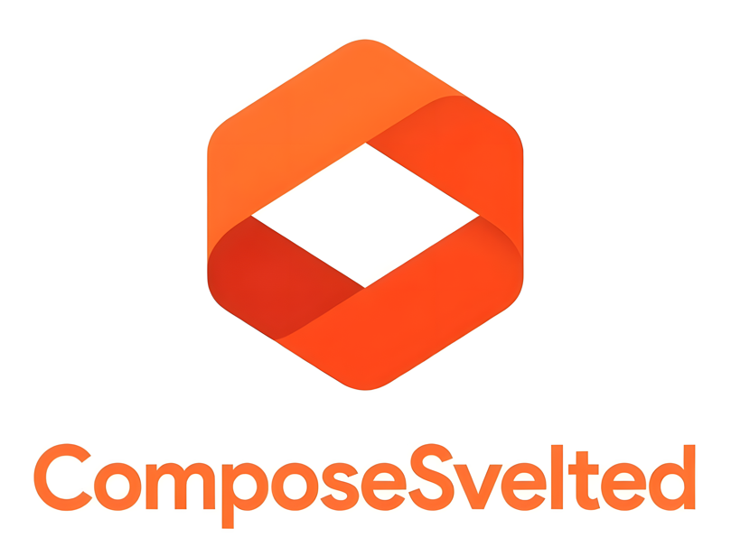
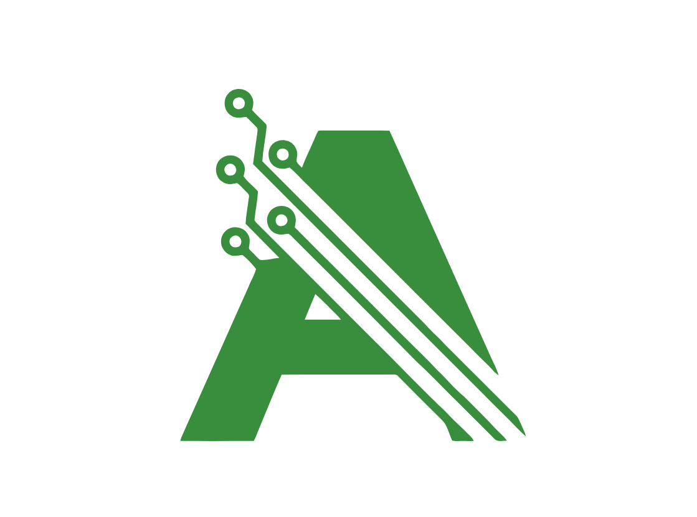

<h1 align="left">Hola, soy <a href="https://danieldevsite.lovable.app">Daniel (DanielitoCode)</a></h1>

  

## Sobre mi

Desarrollador Android (Kotlin) enfocado en arquitectura, buenas practicas y herramientas para construir productos escalables. En paralelo, construyo side projects web con Svelte.

<h2 align="left">Languages and Tools</h2>

### Mobile (Android/Kotlin)

  
  
  
  
  

### Frontend Web

  
  
  
  
  

### Design & Tools

  
  
  
  
  

---

## Android Projects

<table>
  <tr>
    <td width="50%">
      <h3 align="center">AlejoTaller</h3>
      

        
        
Mi proyecto Android mas desarrollado: arquitectura modular (features + core), DI y persistencia local, con backend en Appwrite.

        

          
          
          
          
          
        

      

    </td>
    <td width="50%">
      <h3 align="center">Deluxe</h3>
      

        
        
App Android para joyerías (catálogo/gestión). Proyecto enfocado en UI y flujo de producto.

        

          
          
        

      

    </td>
  </tr>
  <tr>
    <td width="50%">
      <h3 align="center">Iris 🔬 <em>(experimental)</em></h3>
      

        
        
Proyecto experimental de detección de objetos con IA local usando <strong>YOLO11s</strong> — inferencia completamente on-device, sin servidor.

        

          
          
          
          
          
        

      

    </td>
    <td width="50%"></td>
  </tr>
</table>

## Proyectos en desarrollo

<table>
  <tr>
    <td width="50%">
      <h3 align="center">AppMakeUp</h3>
      

        
        
Tooling para modelar y generar estructuras base de apps de forma predecible (architecture-first).

        

          
          
          
        

      

    </td>
    <td width="50%">
      <h3 align="center">compose_svelted</h3>
      

        
        
UI framework para Svelte inspirado en Jetpack Compose: layout declarativo, modifiers inmutables y navegación tipo Compose.

        

          
          
          
        

      

    </td>
  </tr>
</table>

## Web Frontend

<table>
  <tr>
    <td width="50%">
      <h3 align="center">dash_alejo_taller</h3>
      

        
        
Aplicación web en Svelte complementaria para <strong>AlejoTaller</strong>: gestión de productos a la venta para la tienda de electrónica.

        

          
          
          
          
        

      

    </td>
    <td width="50%"></td>
  </tr>
</table>

## Functions serverless & Cloudflare Workers

<table>
  <tr>
    <td width="50%">
      <h3 align="center">starter-function</h3>
      

        
        
Plantilla/arranque para funciones serverless y Workers (ideal para APIs ligeras y automatizaciones).

        

          
          
          
        

      

    </td>
    <td width="50%">
      <h3 align="center">google_auth_appwrite</h3>
      

        
        
Cloudflare Worker que implementa un flujo de autenticación con Google OAuth para <strong>Appwrite BaaS</strong>.

        

          
          
          
          
        

      

    </td>
  </tr>
  <tr>
    <td width="50%">
      <h3 align="center">telegram_messages</h3>
      

        
        
Función Node.js para enviar mensajes a un grupo de Telegram desde el backend, usando el BotFather API.

        

          
          
          
          
        

      

    </td>
    <td width="50%">
      <h3 align="center">list_users</h3>
      

        
        
Función serverless en Appwrite para listar usuarios con control de acceso por rol <strong>Admin</strong>.

        

          
          
          
        

      

    </td>
  </tr>
</table>

---

## Conectate

- Email: `daniel.imbert96@gmail.com`
- LinkedIn: `www.linkedin.com/in/daniel-imbert-68b4952b4`

Ultima actualizacion: marzo 2026
